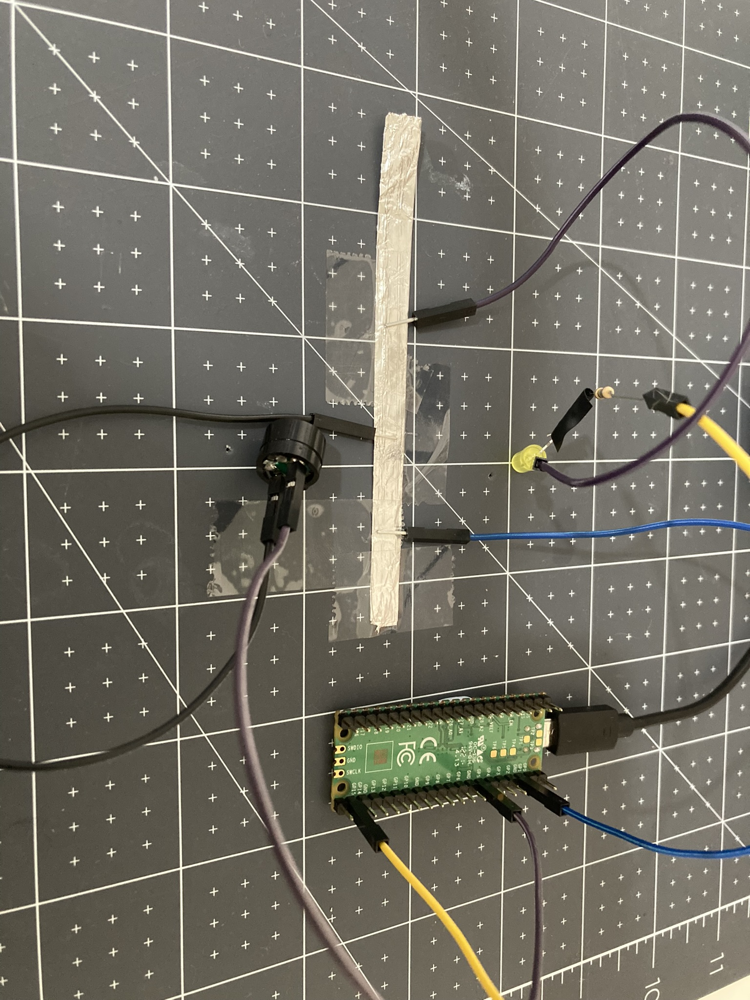

Il n'y a que 8 broches **GND** sur un Raspberry Pi Pico. Cela signifie que si tu souhaites utiliser plus de 8 composants, tu devras partager un **GND**. Voici une méthode pour partager une broche de terre :

Tu auras besoin de :
+ deux fils de liaison broche-prise
+ du papier d'aluminium, du ruban conducteur ou un autre matériau conducteur
+ bande adhésive

**Étape 1** : Crée une bande de papier d'aluminium ou utilise ton autre matériau conducteur.

**Étape 2** : Connecte une broche **GND** à ton papier aluminium (utilise du ruban adhésif pour fixer).

{:width="500px"}

**Étape 3** : Lors de l'ajout d'un composant au Raspberry Pi Pico, connecte l'extrémité **positive** à une broche **GP** et l'extrémité **négative** à la feuille d'aluminium.

{:width="500px"}

**Étape 4** : Lors de l'ajout d'autres composants, assure-toi que l'extrémité **positive** est connectée à une broche **GP** sur le Raspberry Pi Pico et que l'extrémité **négative** est collée à la feuille d'aluminium.

{:width="500px"}