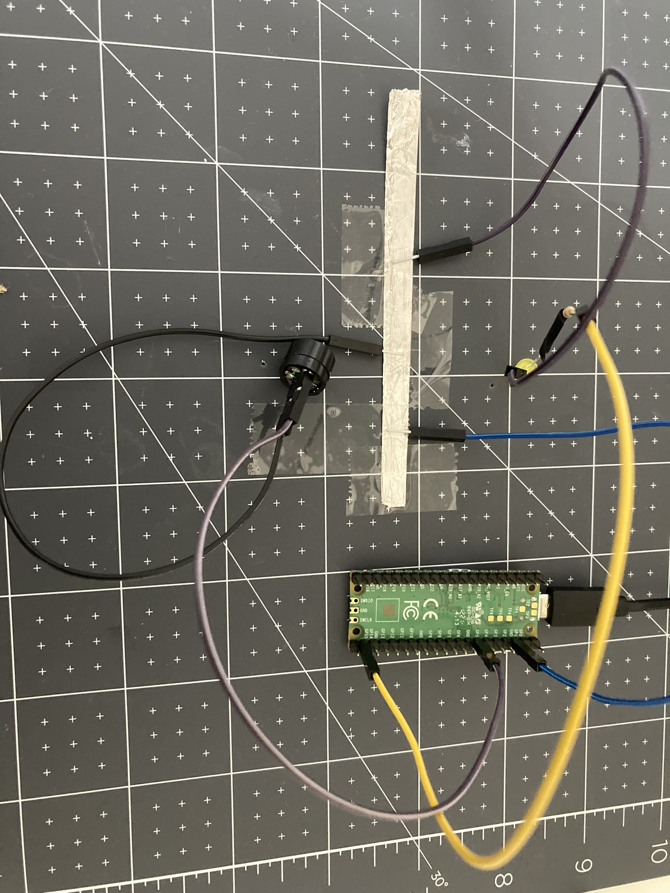

There are only 8 **GND** pins on a Raspberry Pi Pico. This means that if you want to use more than 8 components, you will need to share a **GND**. Here is one method for sharing a ground pin:

You will need:
+ pin-socket jumper wires
+ some kitchen foil, conductive tape or some other conductive material
+ sticky tape

**Step 1**: Create a strip of kitchen foil or use your other conductive material.

**Step 2**: Connect a **GND** pin to your kitchen foil (use sticky tape to secure).

{:width="500px"}

**Step 3**: When adding a component to the Raspberry Pi Pico, connect the **positive** end to a **GP** pin and the **negative** end to the kitchen foil.

{:width="500px"}

**Step 4**: When adding further components, ensure that the **positive** end is connected to a **GP** pin on the Raspberry Pi Pico and that the **negative** end is stuck to the kitchen foil.

{:width="500px"}