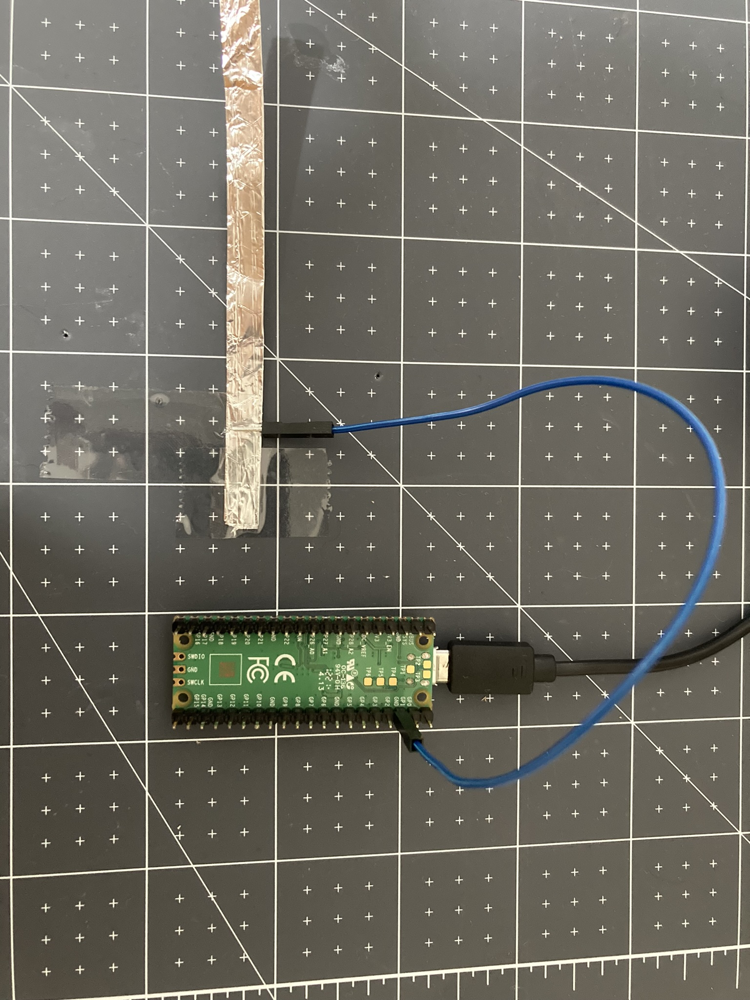
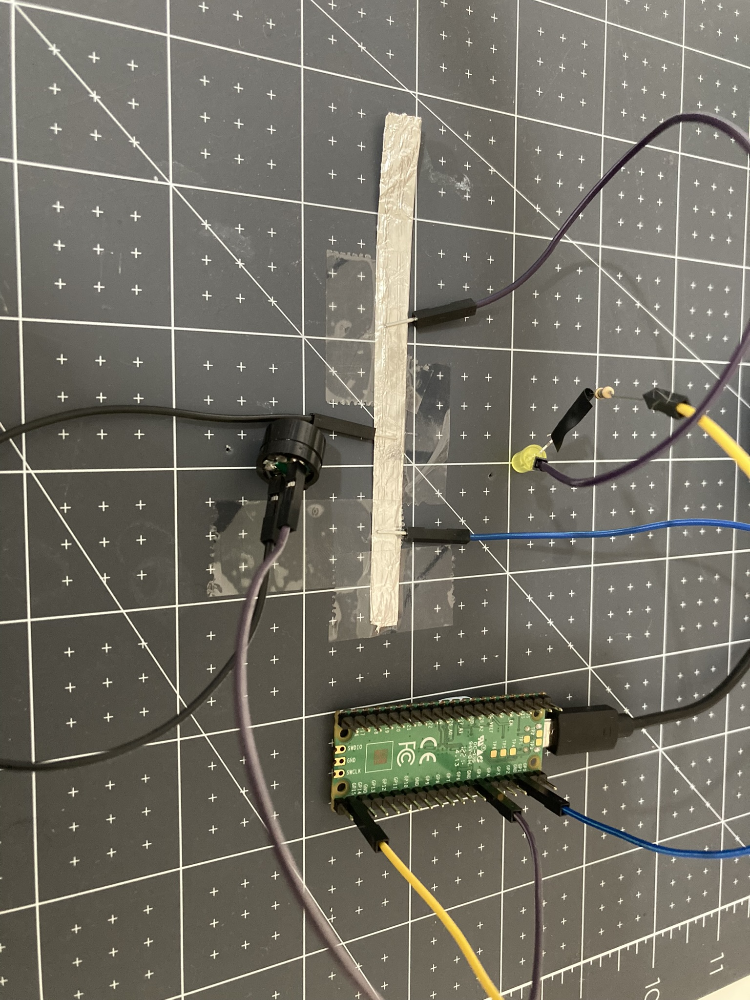

Er zijn slechts 8 **GND**-pinnen op een Raspberry Pi Pico. Dit betekent dat als je meer dan 8 componenten wilt gebruiken, je een **GND** moet delen. Hier is een methode om een aardingspin te delen:

Je hebt nodig:
+ verbindingsdraden met pin-bus aansluiting
+ wat aluminiumfolie, geleidende tape of een ander geleidend materiaal
+ plakband

**Stap 1**: Maak een strook van aluminiumfolie of gebruik ander geleidend materiaal.

**Stap 2**: Sluit een **GND** pin aan op je aluminiumfolie (gebruik plakband om vast te zetten).

{:width="500px"}

**Stap 3**: Bij het toevoegen van een component aan de Raspberry Pi Pico, verbind de **positieve** uiteinden met een **GP** pin en de **negatieve** uiteinden met het aluminiumfolie.

{:width="500px"}

**Stap 4**: Zorg er bij het toevoegen van nog meer componenten voor dat het **positieve** uiteinde is aangesloten op een **GP** pin op de Raspberry Pi Pico en dat het **negatieve** uiteinde op het aluminiumfolie is geplakt.

{:width="500px"}